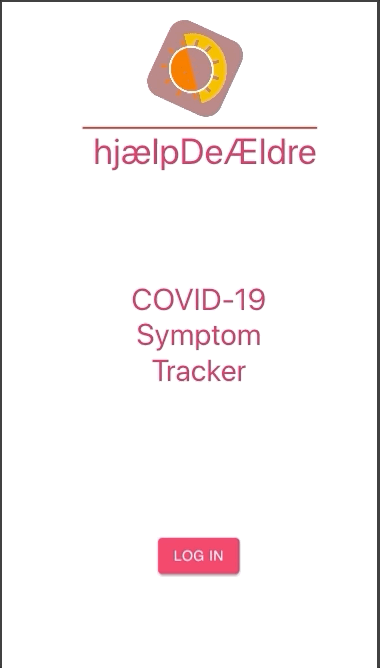

# HYF - Group 14 hackaton app



During the COVID-19 situation, Hack Your Future has started a hackaton focused on coming up with solutions using programming
that would help people in this pandemic state. Group 14 decided to focus on the elderly population with an app that tracks
symptoms.

## Live preview

You can access live preview on the [link](https://hyf-group14.herokuapp.com/). *Please keep in mind that the app was designed mobile fist and desktop view wasn't inslucded in this MVP.*

## Prerequisites

Make sure you have these to make the app run:
* Have latest Node version installed: https://nodejs.org/en/
* Have react installed
* Have npm or yarn installed
* Have github installed and configured

## Getting Started/ Installing

Clone the repo to your local machine.

In root folder of the project run
```
 yarn or npm install
```

## Running the project

### Running the server
* In the root folder run *yarn build* or *npm run build* - this will create a minified build of the application
* Once the build is complete, whilst staying in the root folder, run *yarn start* or *npm start*
* Navigate to _localhost:8080_ and enjoy!

### Running the development environment
* In the root run *yarn dev* or *npm run dev*
* Navigate to _localhost:3000_ and enjoy
* Every change you make in source code will trigger a refresh in the browser tab

## Built With

* [React](https://reactjs.org/) - Framework used
* [CRA - Create React App](https://github.com/facebook/create-react-app) - Initialization and webpack config

## Authors

* **Mahie Akhtar** - *Initial work* - [mahieakhtar](https://github.com/mahieakhtar)
* **Pallabi Ghosh** - *Initial work* - [Pallabi-ghosh](https://github.com/Pallabi-ghosh)
* **Ghofrane Ben Hmaid** - *Initial work* - [mahieakhtar](https://github.com/mahieakhtar)
* **Mohammed El Shawa** - *Initial work* - [mahieakhtar](https://github.com/mahieakhtar)
* **Filip Malek** - *Initial work* - [REX500](https://github.com/REX500)

## License

This project is licensed under the MIT License - see the [LICENSE.md](LICENSE.md) file for details

## Acknowledgments

* Hat tip to Chris Achard for making an good but someplaces outdated Egghead tutorial @https://egghead.io/courses/build-a-react-native-application-for-ios-and-android-from-start-to-finish
